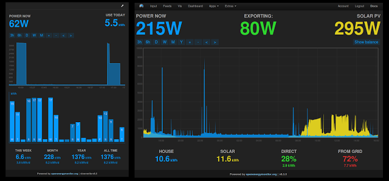

# Emoncms Clients for Home Energy Monitoring

## EmonCMS
[EmonCMS](https://emoncms.org/) is a powerful open-source web-app for processing, logging and visualising energy, temperature and other environmental data. This can be used to monitor the current consumption for your home using simple components.

## NodeMCU
[NoeMCU](http://nodemcu.com/index_en.html) is an open source IoT platform. It includes firmware which runs on the ESP8266 Wi-Fi SoC from Espressif Systems, and hardware which is based on the ESP-12 module. The term "NodeMCU" by default refers to the firmware rather than the dev kits. The NodeMCU is ment to be used with the [eLua](http://www.eluaproject.net/) project, but can also be programmed with the [Arduino IDE Environment](https://www.arduino.cc/) with a few adjustments. See the Sparkfun [ESP8266 Thing Hookup Guide](https://learn.sparkfun.com/tutorials/esp8266-thing-hookup-guide/installing-the-esp8266-arduino-addon) for details.


## TSL250
The [TSL250R-LF](https://www.digikey.com/product-detail/en/ams/TSL250R-LF/TSL250-R-LF-ND/3095043) is an optical light to voltage sensor that signals if there is light present or not. This will be used for triggering interrupts in the NodeMCU, and count the timing between the 1000pulses/KWh on the home power central.


## Connections and Interrupt handling
The TSL250R-LF is connected to the *3.3V*, *GND* and *D1* terminals of the NodeMCU. The *D1* connector is then setup for interrupt handling in the the Arduino code:
```cpp
  // Attach interupt for capturing light pulses on powercentral
  attachInterrupt(digitalPinToInterrupt(D1), onPulse, FALLING);
```

Note that GPIO0, GPIO2, GPIO6-11 and GPIO15 has dual meaning on the ESP module, and might affect startup, or operating mode of the module. Using D1 - GPIO5 in this project to avoid the problem all toghether. Started using D4 (GPIO2), but this affected bootup, and flashing, so if there was a powerfailure or reset the device would not boot. For more info search the web.

### Interrupt filtering
For avoiding ripple in the interrupt triggering, and getting false readings there is made a small time validation in the *onPulse()* method
```cpp
// The interrupt routine - runs each time a falling edge of a pulse is detected
void onPulse()                  
{
  if ((micros() - lastTime) >= MIN_ELAPSED_TIME)  //in range
  {
    lastTime = pulseTime;        //used to measure time between pulses.
    pulseTime = micros();
    // Put time calculations between interrupts here
```

## EmonCMS Client
### HTTP Client
The HTTP client made uses the EmonCMS HTTP API, with the private *API_WRITE_KEY* from your EmonCMS account to update the values.

### EmonCMS.org
Example for monitoing data representation on emoncms.org



## Secrets.h
In the *.gitignore* file there is put a file called *Secrets.h*. This is a .h file ment to keep passwords and other connection details like the emoncms *API_WRITE_KEY*. This will not be added to the git repository, but must be present alongside the *.ino* files to make the sketch compile. Here is an example on what this file can look like:

```c
#ifndef SECRETS
#define SECRETS

// Define Secrets
#define API_KEY "1232343465dfgegergegrerg"
#define WIFI_SSID "ssid_wifi_name"
#define WIFI_PASSWORD "ssid_wifi_password"

#endif
```
